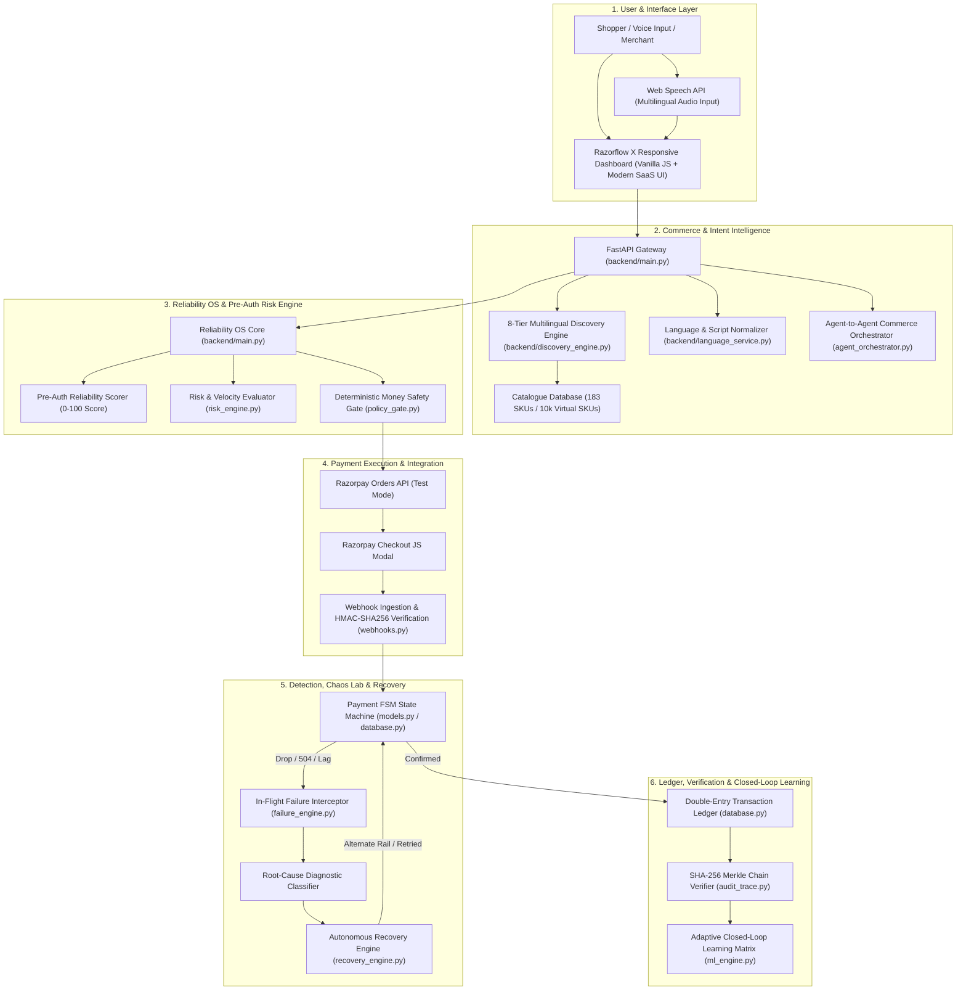
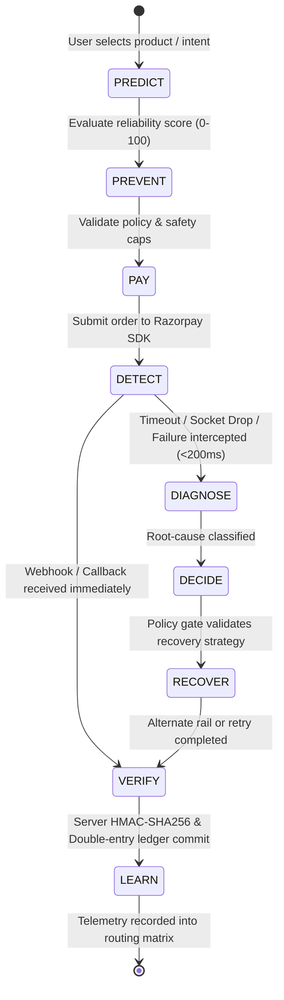
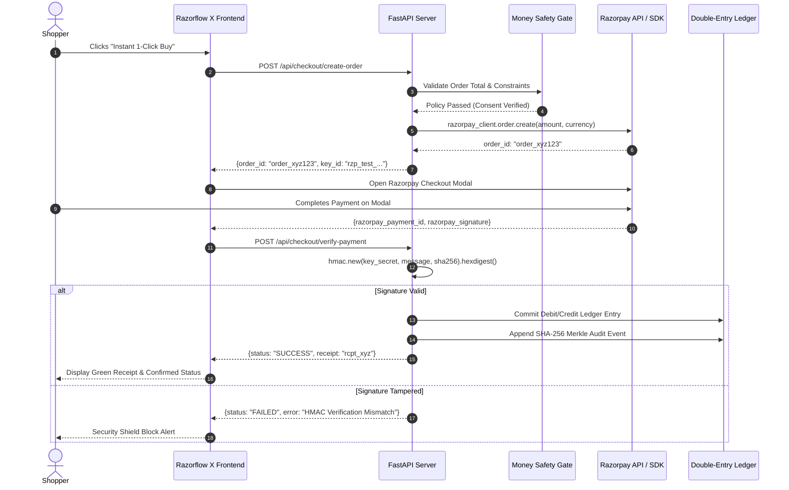

# 🏗️ RAZORFLOW X — System Architecture & Technical Specifications

> **RAZORFLOW X** is an autonomous AI Payment Reliability Operating System designed natively around the 9-stage payment lifecycle:
> **PREDICT ➔ PREVENT ➔ PAY ➔ DETECT ➔ DIAGNOSE ➔ DECIDE ➔ RECOVER ➔ VERIFY ➔ LEARN**

---

## 1. System Overview & Layered Architecture

RAZORFLOW X is structured into distinct, loosely-coupled functional layers ensuring high cohesion, strict safety boundaries, and sub-200ms transaction recovery.



---

## 2. Component Responsibilities & Code Modules

| Component / Module | Source File(s) | Architectural Responsibility |
| :--- | :--- | :--- |
| **API Gateway & Routing** | `backend/main.py`, `main.py` | Exposes REST endpoints, orchestrates state transitions, mounts static assets, coordinates sub-engines. |
| **Discovery & NLP Engine** | `backend/discovery_engine.py`, `backend/language_service.py` | Implements 8-tier phonetic search ladder, Levenshtein distance, multilingual intent extraction (Hindi, Tamil, Telugu, Spanish, English). |
| **A2A Commerce Orchestrator** | `agent_orchestrator.py`, `agentic_checkout.py` | Facilitates structured 6-turn multi-agent negotiations between Buyer Agent and Merchant Agent. |
| **Money Safety Gate** | `policy_gate.py` | Enforces hard deterministic safety bounds (max ticket ₹20,000, max discount 25%, mandatory consent). |
| **Payment Gateways** | `gateways.py` | Interfaces with official Razorpay Python SDK, manages payment order generation and simulated multi-rail fallbacks. |
| **Webhook Verifier** | `webhooks.py` | Cryptographically verifies HMAC-SHA256 signatures on inbound webhooks and manages idempotency locks. |
| **Failure Interceptor** | `failure_engine.py` | Simulates and catches 7 chaos failure modes (timeouts, socket drops, race conditions, delays). |
| **Autonomous Recovery** | `recovery_engine.py` | Computes optimal recovery strategies (exponential backoff, 1-click UPI fallbacks, proactive polling). |
| **Cryptographic Audit Ledger** | `audit_trace.py` | Generates immutable SHA-256 Merkle hash chains for verifiable state history. |
| **Double-Entry Ledger** | `database.py`, `models.py` | Maintains atomic double-entry bookkeeping ensuring balance invariants: $\sum \text{Debits} = \sum \text{Credits}$. |
| **Growth & ML Engine** | `growth_engine.py`, `ml_engine.py`, `experiments.py` | Powers 1,000-session Monte Carlo A/B simulation, dynamic bundle generation, and closed-loop routing weights. |

---

## 3. The 9-Stage Payment Reliability Lifecycle



### 1. PREDICT (Pre-Auth Intent Analysis)
- Analyzes buyer velocity, ticket size, historical gateway uptime, and network latency.
- Calculates an explainable **Payment Reliability Score (0–100)** prior to checkout initiation.

### 2. PREVENT (Policy Guardrails)
- Deterministically blocks transactions that exceed risk thresholds or policy constraints.
- Prevents price slippage, invalid coupon stacking, and unconfirmed agent commitments.

### 3. PAY (Compliant Payment Execution)
- Creates orders via official Razorpay Orders API (`/v1/orders`).
- Invokes client-side Razorpay Checkout JS modal with test keys.

### 4. DETECT (In-Flight Failure Interception)
- Listens for gateway timeout (504), network socket resets, or duplicate click race events.
- Intercepts dropped transactions within **< 200 milliseconds** before the customer abandons the page.

### 5. DIAGNOSE (Root-Cause Classification)
- Categorizes failure mode into one of 7 standardized failure classes:
  - `BANK_TIMEOUT_504`
  - `SOCKET_DROP`
  - `DUPLICATE_RACE`
  - `CARD_DECLINE_INSUFFICIENT_FUNDS`
  - `WEBHOOK_DELAY_45S`
  - `SIGNATURE_TAMPER`
  - `RETRY_BOUNDARY_EXCEEDED`

### 6. DECIDE (Safety & Idempotency Evaluation)
- Validates that recovery action does not exceed maximum allowable retries or create double-charges.
- Acquires an atomic 256-bit lock key for the order ID.

### 7. RECOVER (Autonomous Self-Healing)
- Executes bounded recovery without forcing full cart re-entry:
  - **Timeout ➔ Exponential Backoff Retry**
  - **Socket Drop ➔ Idempotent Reconnection**
  - **Card Decline ➔ 1-Click Zero-Re-Entry UPI Alternative**
  - **Webhook Delay ➔ Proactive Polling & Reconciliation**

### 8. VERIFY (Cryptographic Proof)
- Verifies server-side HMAC-SHA256 signature against `RAZORPAY_KEY_SECRET`.
- Commits dual-entry ledger records and computes SHA-256 Merkle block proof.

### 9. LEARN (Closed-Loop Feedback)
- Feeds resolution metrics back into the adaptive routing matrix, dynamically adjusting gateway preference weights for future sessions.

---

## 4. Payment Flow & Webhook Verification



---

## 5. Failure & Autonomous Recovery Flows

```mermaid
flowchart TD
    Start([In-Flight Payment Initiated]) --> Monitor{Failure Detected?}
    Monitor -- No --> Success[200 OK: Webhook Verified]
    Monitor -- Yes: 504 Timeout --> T1[Intercept Timeout Signal]
    Monitor -- Yes: Duplicate Click --> T2[Atomic Dedup Check]
    Monitor -- Yes: Card Decline --> T3[Intercept Decline Code]
    Monitor -- Yes: Webhook Lag --> T4[45s Webhook Timer Expired]

    T1 --> R1[Acquire Idempotency Key ➔ Exponential Backoff Retry]
    T2 --> R2[Atomic Lock Drops Duplicate ➔ Return Existing Order State]
    T3 --> R3[Present 1-Click Instant UPI Fallback Modal]
    T4 --> R4[Proactive Polling: GET /v1/payments/{id} ➔ Reconcile]

    R1 --> Verify[Verify Final State]
    R2 --> Verify
    R3 --> Verify
    R4 --> Verify
    Verify --> Commit[Commit to Double-Entry Ledger & Merkle Audit Trail]
```

---

## 6. Trust Boundary & AI Recommendation vs Authorization

A core architectural principle of RAZORFLOW X is the **separation of proposal from authorization**:

```
+-------------------------------------------------------------+
|                 UNTRUSTED PROPOSAL LAYER                    |
|  - AI Copilot Natural Language Intent Mappings              |
|  - Multi-Agent A2A Negotiation Proposals                    |
|  - Growth Engine Upsell & Bundle Discount Proposals         |
+-------------------------------------------------------------+
                              |
                              | (JSON Proposal Payload)
                              v
+-------------------------------------------------------------+
|               DETERMINISTIC MONEY SAFETY GATE               |
|  - Spending Cap Enforcer (<= Rs 20,000 per order)           |
|  - Margin Slippage Cap (Max Discount <= 25%)                |
|  - Explicit Shopper Consent Verification Check              |
|  - Atomic 256-Bit Idempotency Key Acquisition               |
+-------------------------------------------------------------+
                              |
                              | (Authorized & Signed Order)
                              v
+-------------------------------------------------------------+
|                 FINANCIAL EXECUTION LAYER                   |
|  - Razorpay Orders API (`api.razorpay.com`)                 |
|  - HMAC-SHA256 Cryptographic Verification                   |
|  - Immutable Double-Entry Ledger & SHA-256 Merkle Proofs    |
+-------------------------------------------------------------+
```

---

## 7. Idempotency & Duplicate Protection Architecture

1. **256-Bit Idempotency Key Generation**: Each unique transaction intent generates a deterministic SHA-256 key:
   $$\text{IdempotencyKey} = \text{HMAC-SHA256}(\text{CartHash} \parallel \text{TimestampWindow} \parallel \text{BuyerID})$$
2. **Atomic Lock Acquisition**: Before sending orders to the Razorpay API, the system performs an atomic check-and-set lock.
3. **Duplicate Request Handling**: If a shopper double-clicks or rapid-fires checkout requests, subsequent calls are intercepted at the lock layer, returning the active in-flight order state without creating a second billing order.

---

## 8. Cryptographic Auditability & Merkle Trees

Every system event (order creation, policy evaluation, failure detection, recovery action, ledger commit) produces an immutable audit record:

$$\text{BlockHash}_n = \text{SHA-256}(\text{EventPayload} \parallel \text{Timestamp} \parallel \text{BlockHash}_{n-1})$$

The entire chain can be audited at any point via `audit_trace.py`, providing mathematically verifiable compliance and zero-tampering guarantees.
