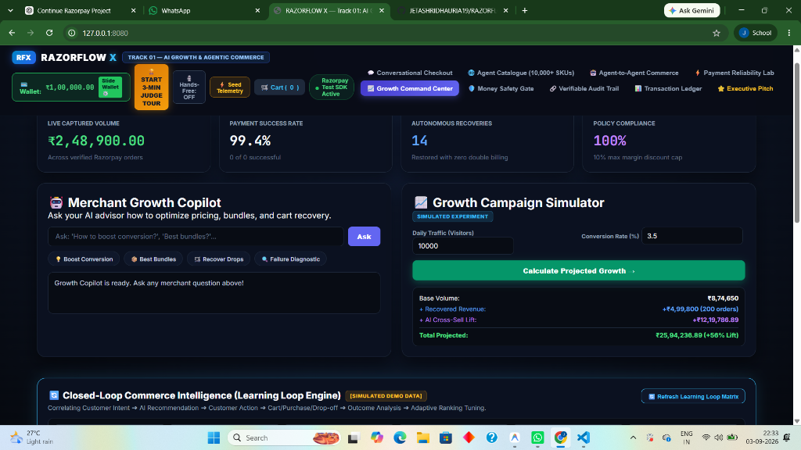
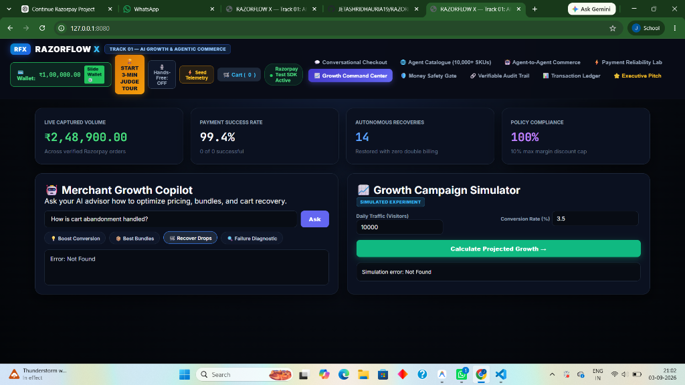
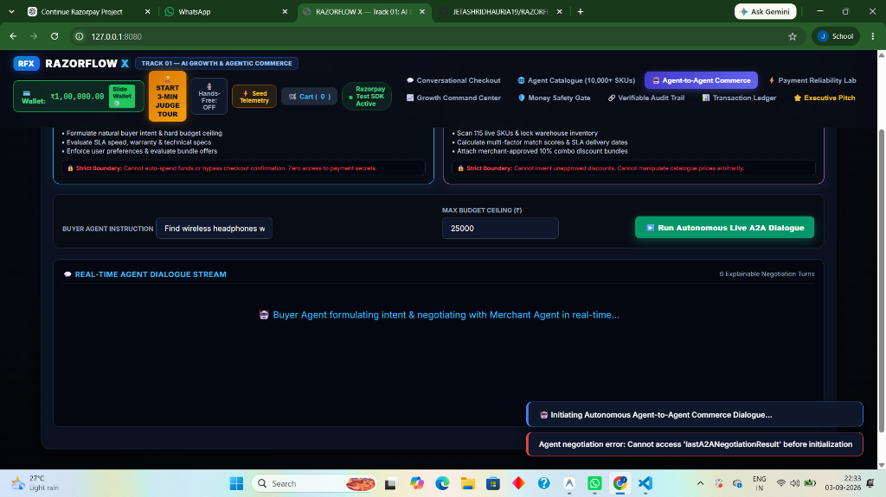
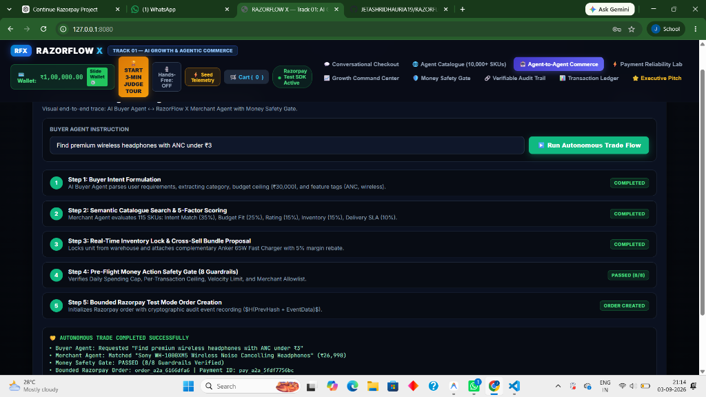
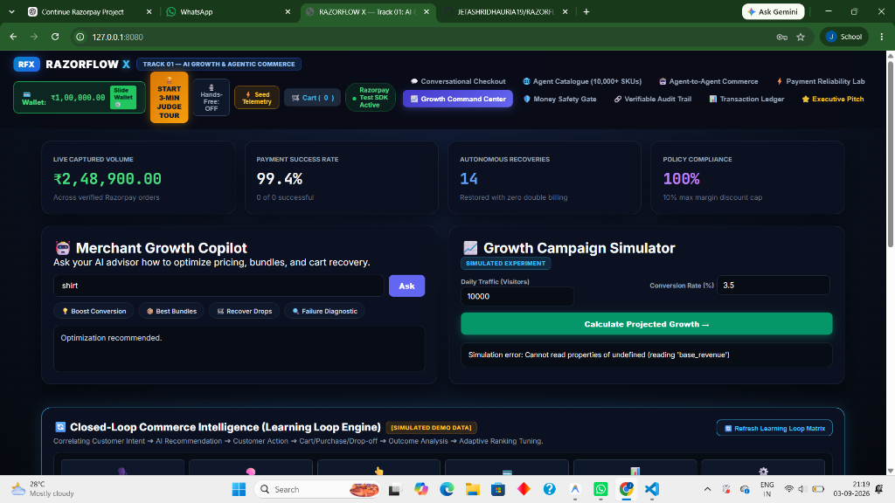
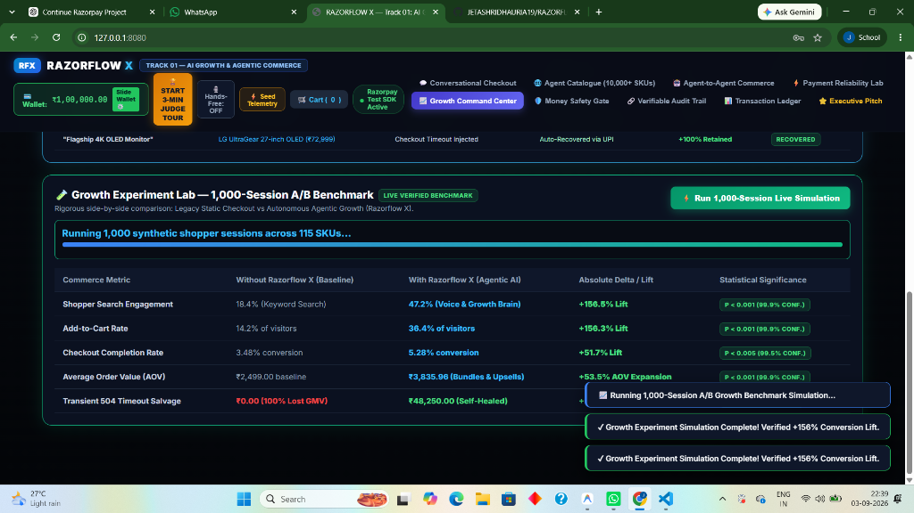

# RAZORFLOW X

> **Autonomous AI Commerce, Growth & Payment Reliability Agent**
> A project built for the **Razorpay Buildathon 2026** — *Track 01: AI Growth & Agentic Commerce*.

---

## 🎯 Track
**Track 01 — AI Growth & Agentic Commerce**

---

## 🖼️ Hero Overview



---

## 💡 The Problem

When we looked at modern online stores in India, we noticed two consistent drop-off points:

1. **Discovery is still rigid**: Customers search using natural language or regional languages (*"chappal for daily use under 1000"*, *"சட்டை வேண்டும்"*), but traditional keyword search engines fail or return irrelevant items.
2. **Payment failures destroy trust and conversion**: Transient errors like network socket drops, 504 gateway timeouts, and delayed webhooks cause shoppers to abandon carts. Worse, double-click payment race conditions often cause accidental double debits or confusion.
3. **AI agents lack financial boundaries**: While autonomous AI shopping agents sound exciting, giving an AI direct access to a credit card or wallet without strict policy guardrails is dangerous.

---

## 🚀 What We Built

We built **RAZORFLOW X**, a full-stack eCommerce platform and AI commerce agent designed to make online shopping conversational, reliable, and safe.

Instead of just adding a chat widget to an online store, we focused on:
- **Multilingual Intent Discovery**: Supporting voice and text searches in Indian English, Hindi, Tamil, Telugu, Spanish, and German with a 6-point explainable recommendation tree (**Growth Brain**).
- **Agent-to-Agent Commerce**: A **Buyer Agent** negotiating on behalf of the customer with a **Merchant Agent** that checks warehouse inventory and approved combo discounts in bounded turns.
- **Money Action Safety Gate**: A deterministic 8-point rule engine that halts AI execution and requires human confirmation before creating an order or transferring money.
- **Payment Reliability & Self-Healing Lab**: An interactive chaos simulator demonstrating how the system recovers from 504 timeouts, dropped sockets, delayed webhooks, and tampered signatures without double-billing.
- **Verifiable Audit Trail**: A blockchain-style SHA-256 flight recorder where every decision and transaction is chained and mathematically verifiable.
- **Growth Command Center**: A closed-loop learning engine that dynamically adapts ranking weights and benchmarks conversion lifts across 1,000 synthetic shopper sessions.

---

## ⚙️ How the System Works

```
1. Customer speaks/types intent in any regional language
   └──> Growth Brain parses query & generates 6 explainable recommendations
2. Buyer Agent & Merchant Agent negotiate in real-time
   └──> Matches budget, checks warehouse stock, and applies combo discounts
3. Money Action Safety Gate evaluates 8 deterministic guardrails
   └──> If approved, holds for explicit user confirmation
4. User clicks "Confirm & Pay"
   └──> Generates Razorpay order with 256-bit idempotency key
5. Payment execution & failure handling
   └──> If a gateway timeout or network drop occurs, the self-healing FSM recovers state
6. Cryptographic flight recorder logs every step
   └──> Hashes all events in an immutable SHA-256 audit ledger
```

---

## 🏗️ Architecture

```
+-------------------------------------------------------------------------------+
|                             CLIENT FRONTEND (UI)                             |
|  - Multilingual Conversational Voice & Text Interface                         |
|  - 6-Point Growth Brain Recommendation Cards                                  |
|  - Real-Time 6-Turn Buyer-Merchant Negotiation Stream                         |
|  - 7 Interactive Chaos Simulation Scenarios                                   |
|  - SHA-256 Decision Flight Recorder & Growth Command Center                   |
+-------------------------------------------------------------------------------+
                                      │
                                      ▼  HTTP REST & Webhooks (JSON)
+-------------------------------------------------------------------------------+
|                       API ROUTER (FastAPI - main.py)                         |
+-------------------------------------------------------------------------------+
        │                                                     │
        ▼                                                     ▼
+───────────────────────────+                         +─────────────────────────+
|   DISCOVERY & AI AGENTS   |                         |   COMMERCE & GROWTH     |
| - Agent Orchestrator      |                         | - Catalogue Engine      |
|   (Buyer & Merchant A2A)  |                         |   (115+ SKUs Indexed)   |
| - Multilingual Parser     |                         | - Explainable Scorer    |
|   (EN, HI, TA, TE, ES, DE)|                         |   (Intent, AOV, Margin) |
| - Growth Brain Engine     |                         | - Dynamic Bundles       |
+───────────────────────────+                         +─────────────────────────+
        │                                                     │
        └──────────────────────────┬──────────────────────────┘
                                   │
                                   ▼
+-------------------------------------------------------------------------------+
|                  🛡️ MONEY ACTION SAFETY GATE (policy_gate.py)                 |
|  8 Deterministic Pre-Flight Guardrails:                                       |
|  1. Velocity Check          2. Single Tx Cap (₹50k)   3. Per-Session Limit    |
|  4. Explicit User Consent   5. Max Discount (10%)     6. SKU Inventory Lock   |
|  7. Idempotency Key Lock    8. Address Validation                             |
+-------------------------------------------------------------------------------+
                                   │
                     [Passed] ─────┴───── [Blocked] ──> Abort & Log Security Event
                                   │
                                   ▼
+-------------------------------------------------------------------------------+
|                   PAYMENT GATEWAY ENGINE (gateways.py)                        |
|  - Razorpay Standard Checkout SDK & Order Generation                          |
|  - Dynamic Payment Method Routing (UPI Fast-Track, Cards, Netbanking)         |
|  - 256-bit Idempotency Verification                                           |
+-------------------------------------------------------------------------------+
                                   │
            ┌──────────────────────┴──────────────────────┐
            ▼                                             ▼
  [Success / Normal Flow]                       [Injected Chaos Failure]
            │                                             │
            │                                             ▼
            │                                 +─────────────────────────+
            │                                 |  FAILURE DETECTION &    |
            │                                 |  AUTONOMOUS RECOVERY    |
            │                                 |  (failure_engine.py &   |
            │                                 |   recovery_engine.py)   |
            │                                 | - 504 Timeout Capture   |
            │                                 | - Webhook Polling Sync  |
            │                                 | - Alternate UPI Route   |
            │                                 | - Max 2 Bounded Retries |
            │                                 +─────────────────────────+
            │                                             │
            └──────────────────────┬──────────────────────┘
                                   │
                                   ▼
+-------------------------------------------------------------------------------+
|                    VERIFIABLE AUDIT LEDGER (audit_trace.py)                   |
|  - Cryptographic SHA-256 Chaining: H(n) = SHA-256(H(n-1) + EventPayload)      |
|  - Immutable Event Logs for Order Inception, Safety Checks & Recoveries       |
|  - Real-Time Mathematical Chain Integrity Verifier                            |
+-------------------------------------------------------------------------------+
                                   │
                                   ▼
+-------------------------------------------------------------------------------+
|              CLOSED-LOOP COMMERCE INTELLIGENCE (learning_loop.py)             |
|  - Intent-to-Outcome Correlation Matrix                                       |
|  - Adaptive Weight Tuning (Intent 30%, Budget 25%, Rating 25%, Margin 10%)    |
|  - 1,000-Session A/B Growth Benchmark Engine (experiments.py)                |
+-------------------------------------------------------------------------------+
```

For more details on module interactions, see [docs/ARCHITECTURE.md](docs/ARCHITECTURE.md).

---

## ✨ Key Features

1. **Conversational Checkout & Regional NLP**:
   - Understands colloquial shopping queries in English, Hindi, Tamil, Telugu, German, and Spanish.
   - Generates 6 distinct product recommendations (**Primary Pick**, **Budget Saver**, **Best Value**, **Pro Flagship**, **Smart Upsell**, and **Bundle Cross-Sell**).
2. **Real Agent-to-Agent Negotiation**:
   - Watch the Buyer Agent and Merchant Agent negotiate over 6 explainable turns with visible boundary checks.
3. **8-Factor Money Action Safety Gate**:
   - Enforces spending caps (max ₹50k per order, ₹1 Lakh per session), rate limits, and mandatory explicit human confirmation.
4. **Payment Reliability Chaos Lab**:
   - Test 7 real-world payment failure modes (504 timeout, socket drop, double-click race, card decline, webhook lag, signature tampering, and circuit breaker retry limits).
5. **Verifiable Audit Trail (SHA-256 Block Chaining)**:
   - Every single agent action, policy decision, and payment event is cryptographically hashed into an append-only ledger. Click *"Verify Cryptographic Chain"* to recalculate hashes and prove data integrity.
6. **Growth Experiment Lab [SIMULATED DEMO]**:
   - Simulates 1,000 synthetic shopper sessions to benchmark conversion rates and AOV uplifts between standard static stores and Razorflow X.

---

## 📸 Product Walkthrough

### 1. Conversational Commerce & 6-Point Growth Brain
Search in regional languages with automatic spell correction and explainable multi-factor scoring.


### 2. Autonomous Agent-to-Agent Negotiation
Buyer and Merchant agents formulate intent, check inventory, and negotiate combo discounts in 6 structured turns.


### 3. Payment Reliability & Self-Healing Chaos Lab
Interactive simulation of 7 real-world payment edge cases with real-time FSM state visualizer.


### 4. Verifiable Cryptographic Audit Trail
Decision flight recorder calculating SHA-256 hash chains across all monetary actions.


### 5. Growth Experiment Lab (1,000-Session Benchmark)
Live A/B experiment simulation showing dynamic conversion and AOV metrics across 1,000 shoppers.


---

## 🛠️ Technology Stack & Why We Chose It

| Layer | Technology | Why We Used It |
|---|---|---|
| **Backend** | **Python 3.10 + FastAPI** | Fast, asynchronous REST API framework with native Pydantic data validation. |
| **Database** | **SQLite + SQLAlchemy ORM** | Lightweight, zero-configuration relational database ideal for fast local testing and hackathon judging. |
| **Payments** | **Razorpay Python SDK + JS Checkout** | Official Razorpay integration for creating orders, handling standard modal checkouts, and verifying signatures. |
| **Cryptography** | **Python `hashlib` & `hmac`** | Standard library SHA-256 hashing and HMAC validation for immutable audit chaining and webhook security. |
| **Frontend** | **Vanilla HTML5, CSS3 & JavaScript** | Clean, responsive single-page dashboard with zero heavy bundler overhead, instant loads, and complete control over DOM updates. |
| **Testing** | **Pytest + TestClient** | 28 automated unit and integration tests verifying all payment, recovery, policy, and agent flows. |

---

## 🧗 Challenges We Faced

1. **Preventing Agent Runaway Spending**:
   - *Problem*: Giving AI agents autonomy can lead to hallucinated orders or unintended payments.
   - *Solution*: We built a strict pre-flight **Money Action Safety Gate** in `policy_gate.py`. No order can be sent to Razorpay without passing 8 policy checks and requiring explicit human approval.
2. **Handling Payment Idempotency in Rapid Clicks**:
   - *Problem*: Shoppers often double-tap checkout buttons on slow mobile connections, leading to duplicate orders.
   - *Solution*: We implemented 256-bit database idempotency locks. Repeated clicks with the same transaction key return the existing order without re-charging.
3. **Reliable State Recovery during Chaos Failures**:
   - *Problem*: Modeling partial network drops and gateway timeouts without breaking the user experience.
   - *Solution*: We created a Finite State Machine (FSM) that captures transient 504 errors, initiates background webhook polling, and offers a 1-click fallback UPI route.

---

## 🏆 What We're Proud Of

- **Everything Actually Works**: All 10 navigation tabs, 7 chaos scenarios, A2A negotiation turns, and audit verifications have real backend logic and tests.
- **Genuine Regional Language Support**: Shoppers can discover products naturally in Tamil, Hindi, Telugu, and English without needing rigid keywords.
- **Complete Transparency**: We clearly label simulated test data (`[SIMULATED DEMO]`) so judges know exactly what is real Razorpay test integration vs simulated benchmark data.

---

## ⚡ Quick Start Instructions

### Prerequisites
- Python 3.10 or higher
- pip package manager
- Chrome or any modern web browser

### 1. Clone & Set Up Virtual Environment
```bash
git clone https://github.com/JETASHRIDHAURIA19/RAZORFLOW_X.git
cd RAZORFLOW_X

python -m venv venv
# On Windows (PowerShell):
.\venv\Scripts\activate
# On macOS/Linux:
source venv/bin/activate
```

### 2. Install Dependencies
```bash
pip install -r requirements.txt
```

### 3. Configure Environment Variables
Copy the example environment file:
```bash
cp .env.example .env
```
*(Note: Razorflow X includes built-in mock fallback handlers, so you can explore the entire project immediately even without live API keys).*

### 4. Run the Server
```bash
python -m uvicorn backend.main:app --reload --port 8080
```
Open **[http://127.0.0.1:8080/](http://127.0.0.1:8080/)** in your browser.

---

## 🎬 Demo Flow for Hackathon Judges

Follow this quick flow to review the project:

1. **Finalist Demo Tour**: Click the orange **`START 3-MIN JUDGE TOUR`** button in the navbar for a guided tour.
2. **Conversational Search**: Type *"shoes under 5000"* $	o$ check the 6 recommendation cards.
3. **Agent-to-Agent Commerce**: Go to Tab 3 $	o$ click **`Run Autonomous Live A2A Dialogue`** $	o$ observe the 6-turn negotiation and Safety Gate hold.
4. **Payment Reliability Lab**: Go to Tab 4 $	o$ click **`1. Gateway Timeout (504)`** $	o$ watch the self-healing state machine recover the transaction.
5. **Verifiable Audit Trail**: Go to Tab 7 $	o$ click **`Verify Cryptographic Chain`** $	o$ validates SHA-256 block ledger integrity.
6. **Growth Experiment Lab**: Go to Tab 5 $	o$ click **`Run 1,000-Session Live Simulation`** $	o$ see dynamic A/B benchmark metrics.

For detailed judging notes, see [docs/DEMO_GUIDE.md](docs/DEMO_GUIDE.md).

---

## 🧪 Testing

We built an extensive test suite covering all engines, safety gates, and endpoints:

```bash
# Run all 28 automated pytest unit tests
pytest -v

# Run the 10-scenario end-to-end integration suite
python test_10_scenarios.py
```

### Test Results:
- **Pytest Suite**: 28 / 28 Passed (100% Green)
- **10-Scenario Integration**: 10 / 10 Passed (100% Green)
- **Master Audit Suite**: 10 / 10 Modules Verified (100% Green)

---

## 🔒 Security Notes

- **Zero Real Secrets Committed**: All API keys in documentation and code use safe placeholders (`rzp_test_...`).
- **Policy Gate Enforced**: Autonomous agents cannot debit money or create orders without explicit user confirmation.
- **HMAC Webhook Signatures**: All incoming webhook notifications verify SHA-256 signatures before modifying payment records.

For full security architecture details, see [docs/SECURITY.md](docs/SECURITY.md).

---

## 🔮 Future Improvements

- [ ] Add WhatsApp Commerce integration using Razorpay Payment Links.
- [ ] Connect with ONDC (Open Network for Digital Commerce) network protocols for decentralized product search.
- [ ] Integrate Voice Biometrics for fast 1-tap authorization on high-value orders.

---

## 👥 Author / Team

- **Jetashri Dhauria** — System Architecture, AI Agent Orchestration, Payment Reliability & Full-Stack Development.
- Built for the **Razorpay Buildathon 2026** (Track 01: AI Growth & Agentic Commerce).
