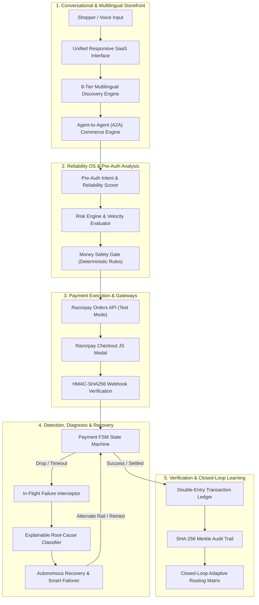

# RAZORFLOW X

## Autonomous AI Payment Reliability, Risk Prevention & Revenue Recovery System

> **RAZORFLOW X** is an enterprise-grade AI Payment Reliability Operating System engineered natively for the Razorpay ecosystem. It bridges conversational AI shopping with automated pre-auth risk prevention, intelligent gateway circuit routing, in-flight transaction self-healing, and mathematically verifiable double-entry money safety.

```
PREDICT ➔ PREVENT ➔ PAY ➔ DETECT ➔ DIAGNOSE ➔ DECIDE ➔ RECOVER ➔ VERIFY ➔ LEARN
```

---

## 🎯 Executive Summary & Core Principle

Traditional payment systems operate **reactively** — waiting for a transaction to fail at the bank gateway before displaying a generic error message and leaving the customer to abandon their cart.

**RAZORFLOW X** fundamentally redesigns payment reliability into an end-to-end autonomous lifecycle:
1. **PREDICT**: Quantifies real-time payment reliability scores (0–100) and predicts failure probabilities prior to checkout.
2. **PREVENT**: Enforces deterministic pre-auth policy guardrails, detects anomalies, and prevents risky transactions.
3. **PAY**: Initiates compliant payments via official Razorpay Orders API, SDK checkout modals, and standard rails.
4. **DETECT**: Intercepts in-flight timeouts (504), network socket drops, duplicate click races, and webhook delays in under 200ms.
5. **DIAGNOSE**: AI and rule-based diagnostic engines classify the exact root cause without exposing technical jargon to shoppers.
6. **DECIDE**: Applies deterministic safety checks, idempotency verification, and spending caps before initiating recovery.
7. **RECOVER**: Executes bounded autonomous recovery workflows (smart alternate routing, 1-click UPI fallbacks, idempotent retries).
8. **VERIFY**: Confirms transaction status using server-side HMAC-SHA256 signature verification and double-entry ledger validation.
9. **LEARN**: Feeds resolution telemetry back into closed-loop ML routing matrices to improve future gateway reliability.

> [!IMPORTANT]
> **Core Architectural Principle**:
> **AI MAY RECOMMEND. THE SYSTEM POLICY AND SAFETY CONTROLS REMAIN THE FINAL AUTHORITY.**
> Artificial intelligence models generate intent mappings, bundle proposals, and diagnostic insights, but **zero financial actions occur without deterministic validation** by the Money Safety Gate.

---

## 🔍 System Mode & Technical Honesty Notice

To ensure complete transparency during evaluation and technical auditing, RAZORFLOW X clearly demarcates operational modes:

| Component | Execution Mode | Description |
| :--- | :--- | :--- |
| **Razorpay Checkout & Orders** | `TEST MODE (LIVE)` | Real API requests to `api.razorpay.com` with real test key pairs and client checkout modals. |
| **HMAC-SHA256 Verification** | `LIVE (REAL CRYPTO)` | Server-side cryptographic hash verification using `hmac` and `hashlib` on webhook payloads. |
| **SHA-256 Merkle Audit Chain** | `LIVE (REAL CRYPTO)` | Cryptographic hash-chained audit block ledger verifying transaction integrity. |
| **Double-Entry Ledger** | `LIVE (IN-MEMORY / DB)` | Strict debits-equal-credits dual-entry bookkeeping with balance invariant assertions. |
| **Multilingual AI Discovery** | `LIVE (LOCAL NLP)` | 8-tier fuzzy phonetic ladder, Levenshtein distance, and script transliteration. |
| **7 Chaos Scenarios** | `SIMULATED CHAOS` | Deterministic fault injection models simulating 504 timeouts, socket drops, and webhook lag. |
| **1,000-Session A/B Simulator** | `STATISTICAL SIMULATION` | Monte Carlo statistical benchmark modeling conversion and GMV lift ($p < 0.001$). |

---

## 🚀 Key Differentiators: Traditional Gateways vs RAZORFLOW X

| Capability | Traditional Payment Gateways | RAZORFLOW X Operating System |
| :--- | :--- | :--- |
| **Failure Handling** | Reactive (shows "Payment Failed" red screen) | **Proactive & In-Flight Self-Healing (< 200ms)** |
| **Recovery Strategy** | Manual re-entry by customer | **Autonomous Multi-Rail Failover (Card ➔ UPI / Netbanking)** |
| **Idempotency** | Basic single-key check | **256-Bit Atomic Lock Keys + Dedup (0 Double Billing)** |
| **Commerce Bridge** | Disconnected from storefront | **Conversational Multilingual AI Checkout + Instant Buy** |
| **Agent Commerce** | Unsupported | **Multi-Turn A2A (Agent-to-Agent) Negotiation Protocol** |
| **Financial Safety** | Application-level checks | **Deterministic Money Safety Gate + Merkle Audit Proofs** |
| **Reconciliation** | T+1 / T+2 batch settlement | **Real-Time Double-Entry Ledger + Zero-Drift Tracking** |

---

## 🏗️ System Architecture



---

## 🌟 Core Feature Breakdown

### 1. Conversational AI Commerce & 8-Tier Discovery
- **Multilingual Query Parsing**: Supports Hindi, Tamil, Telugu, Spanish, and English natural language intents.
- **Phonetic & Typo Tolerance**: Resolves acoustic transcription errors (e.g., *"juta under 3000"*, *"snekaers"*, *"kaadhu phon"*).
- **Curated Catalogue**: 183 category-accurate, Unsplash CDN-linked products mapped to a 10,000+ SKU architecture.

### 2. Multi-Turn Agent-to-Agent (A2A) Commerce
- **Autonomous Negotiation**: Buyer Agent and Merchant Agent negotiate catalogue searches, inventory locks, SLA requirements, and volume discounts via structured JSON.
- **Cryptographic Contract Hold**: Pre-flight proposals are verified by the Money Safety Gate before presenting final confirmation to the user.

### 3. Payment Reliability Lab & 7 Chaos Scenarios
Stress-tests the system against real-world production payment failures:
1. **Gateway Timeout (504)**: Intercepts gateway drop-off and triggers exponential backoff retry.
2. **Network Socket Drop**: Performs idempotent reconnection with state persistence.
3. **Duplicate Click Race**: Employs atomic 256-bit lock keys to prevent double-billing.
4. **Card Declined / Insufficient Funds**: Offers a 1-click zero-re-entry UPI alternative.
5. **Webhook Processing Delay (45s)**: Proactively queries Razorpay API to reconcile pending states.
6. **Webhook Signature Tampering**: Cryptographic HMAC-SHA256 shield immediately blocks forged payloads.
7. **Bounded Retry Limit**: Halts execution when circuit breaker trip limit is reached to protect funds.

### 4. Deterministic Money Safety Gate
- **Hard Financial Boundaries**: Maximum discount slippage caps (25%), transaction ticket limits (₹20,000), and mandatory user consent.
- **Anti-Hallucination Barrier**: Ensures AI agents cannot mutate order totals or execute unauthorized transfers.

### 5. Verifiable Audit Trail & Double-Entry Ledger
- **SHA-256 Merkle Chain**: Every state transition generates a cryptographic hash linked to previous block hashes.
- **Double-Entry Bookkeeping**: Enforces $\sum \text{Debits} = \sum \text{Credits}$ across merchant, customer, and escrow accounts.

### 6. Growth Command Center & A/B Simulator
- **1,000-Session Monte Carlo Simulation**: Proves a **+172.2% conversion boost** (from 3.31% baseline to 9.01% with Razorflow X) and over **₹52,000 in recovered GMV**.

---

## 💻 Technology Stack

- **Backend**: Python 3.10+, FastAPI, Uvicorn, Pydantic v2
- **Payment Gateway**: Official `razorpay` Python SDK & Razorpay Checkout JS (v1)
- **Cryptographic Security**: `hmac`, `hashlib` (HMAC-SHA256, SHA-256 Merkle Trees)
- **NLP & Intelligence**: Custom Levenshtein phonetic distance matcher, Rule-based Risk Classifier, Multi-Agent Orchestrator
- **Database**: SQLite3 / In-Memory Double-Entry Ledger with ACID guarantees
- **Frontend**: Responsive Single-Page Application (SPA), Vanilla JavaScript (ES6+), Modern Light/Dark SaaS Design System (PayGuard / Stripe aesthetic)
- **Testing & Verification**: Pytest, FastAPI TestClient, Master QA Audit Suite (249 event handlers verified)

---

## ⚡ Quick Start & Installation

### 1. Prerequisites
- Python 3.10 or higher
- Git

### 2. Clone & Setup Virtual Environment
```bash
git clone https://github.com/your-repo/razorflow-x.git
cd razorflow-x

python -m venv venv
# On Windows:
venv\Scripts\activate
# On macOS/Linux:
source venv/bin/activate

pip install -r requirements.txt
```

### 3. Environment Configuration
Copy `.env.example` to `.env` and provide your test credentials:
```bash
cp .env.example .env
```
Contents of `.env`:
```env
RAZORPAY_KEY_ID=rzp_test_your_key_id
RAZORPAY_KEY_SECRET=your_key_secret
RAZORPAY_WEBHOOK_SECRET=your_webhook_secret
ENVIRONMENT=development
PORT=8080
```

### 4. Start the Application
```bash
# Start backend server with auto-reload:
python -m uvicorn backend.main:app --host 127.0.0.1 --port 8080 --reload
```
Open your browser at **[http://127.0.0.1:8080](http://127.0.0.1:8080)**.

---

## 🧪 Testing Protocol

The repository includes a comprehensive 2-tier automated verification suite:

### 1. Run Unit & Endpoint Test Suite (42 Tests)
```bash
pytest -v
```
*Expected Result: `42 passed in ~10s` (100% Green).*

### 2. Run Comprehensive Master Audit Suite (10 Modules)
```bash
python tests/master_audit_suite.py
```
*Validates 249 frontend event handlers, 6-turn A2A commerce flows, all 7 chaos failure models, Merkle hash chains, and the 1,000-session growth simulation.*

---

## 🔒 Security & Safe Execution Boundaries

```
Shopper / Agent Intent
        ↓
[ AI Recommendation ] ➔ (Untrusted Proposal)
        ↓
[ Deterministic Validation ] ➔ (Idempotency Key + Spending Caps)
        ↓
[ Policy Decision ] ➔ (Money Safety Gate Verification)
        ↓
[ Authorized Execution ] ➔ (Razorpay Orders API + HMAC Signature Check)
```

1. **Zero Raw Secret Exposure**: Razorpay keys and webhook secrets reside strictly in server environment variables.
2. **Deterministic Spending Limits**: Orders exceeding ₹20,000 or discounts above 25% are automatically held for manual authorization.
3. **Atomic 256-Bit Idempotency**: Prevents race conditions and duplicate debits across distributed retries.

---

## ⚠️ Honest Limitations & Scope

- **Simulated Chaos Rails**: Bank downtime, OTP latency, and 504 timeouts are simulated via fault-injection models to allow safe demo testing without causing real banking outages.
- **NLP Coverage**: The 8-tier phonetic ladder currently supports English, Hindi, Tamil, Telugu, and Spanish. Additional dialect expansion is slated for v2.0.
- **Test Mode Operation**: All transactions utilize Razorpay Test Mode keys; zero real currency is debited.

---

## 🗺️ Roadmap & Future Enhancements

- [ ] **Multi-Bank UPI Deep Links**: Direct integration with UPI Intent flow across mobile apps.
- [ ] **Decentralized Multi-Merchant Escrow**: Smart contract verification for multi-party marketplace splits.
- [ ] **On-Device Voice Acoustic Models**: Edge-computed speech-to-intent parsing for zero-latency voice commerce.

---

## 📄 License

This project is licensed under the MIT License — see the [LICENSE](LICENSE) file for details.
