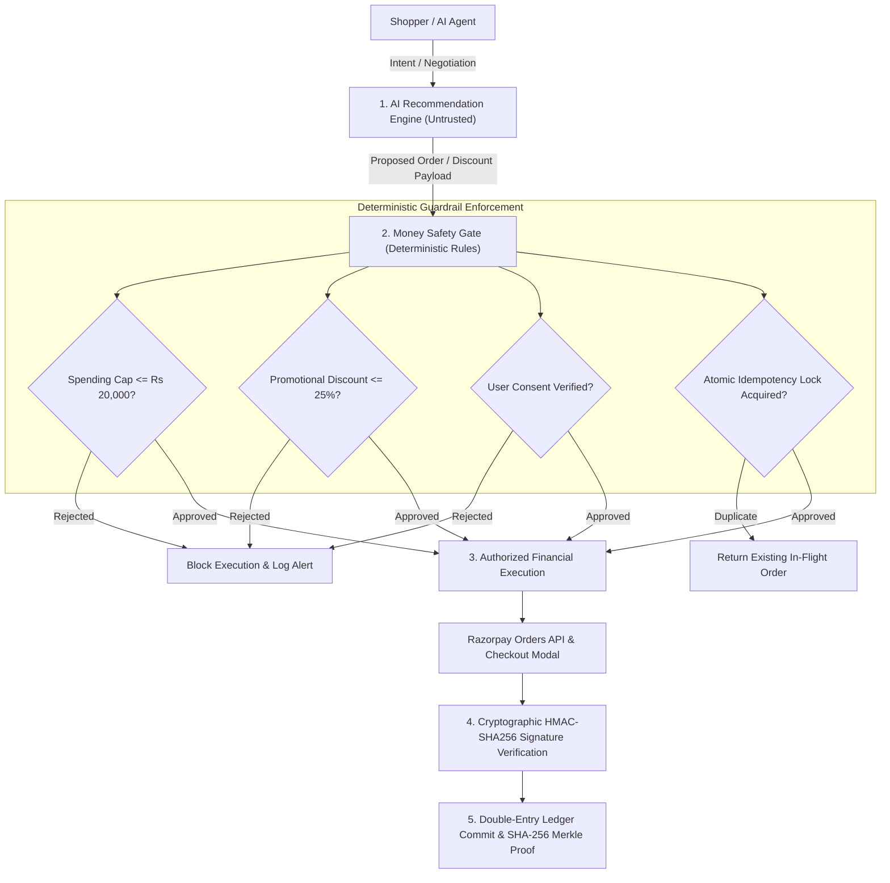

# 🔒 RAZORFLOW X — Security Architecture, Idempotency & Money Safety

This document outlines the security specifications, cryptographic proofs, and money safety guardrails implemented in **RAZORFLOW X**.

---

## 1. Security Architecture & Trust Boundary

A core principle of RAZORFLOW X is that **AI models are treated as untrusted recommendation systems**. No financial execution or balance alteration occurs without deterministic policy verification.



---

## 2. Cryptographic Verification Standards

### 1. Razorpay Payment Signature Verification (`webhooks.py`, `backend/main.py`)
All client-side checkout completions must submit `razorpay_order_id`, `razorpay_payment_id`, and `razorpay_signature`. The backend verifies the payload using HMAC-SHA256:

```python
import hmac, hashlib

def verify_razorpay_signature(order_id: str, payment_id: str, signature: str, secret: str) -> bool:
    generated_sig = hmac.new(
        secret.encode('utf-8'),
        f"{order_id}|{payment_id}".encode('utf-8'),
        hashlib.sha256
    ).hexdigest()
    return hmac.compare_digest(generated_sig, signature)
```

### 2. Webhook Signature Verification (`webhooks.py`)
Incoming webhooks from Razorpay include the `X-Razorpay-Signature` header, which is verified against the raw request body and `RAZORPAY_WEBHOOK_SECRET` before processing.

### 3. SHA-256 Merkle Audit Chaining (`audit_trace.py`)
Every state transition produces a cryptographically chained audit record:
$$\text{Hash}_n = \text{SHA-256}(\text{Payload} \parallel \text{Timestamp} \parallel \text{Hash}_{n-1})$$
Any retroactive modification of transaction history breaks the hash chain and is immediately flagged by `verify_audit_chain()`.

---

## 3. Idempotency & Duplicate Execution Protection

To protect against duplicate payment debits caused by network retries, double-clicking, or delayed webhooks:

1. **Deterministic Idempotency Key**: Generated as `HMAC-SHA256(CartHash + TimestampWindow + UserID)`.
2. **Atomic Lock Mechanism**: Before invoking the Razorpay Orders API, the server acquires an atomic lock in the database.
3. **Duplicate Interception**: Subsequent requests with the same idempotency key return the active order status rather than spawning a new payment order.

---

## 4. Deterministic Money Safety Guardrails (`policy_gate.py`)

| Safety Policy | Hard Boundary | Violation Outcome |
| :--- | :--- | :--- |
| **Max Transaction Ceiling** | ₹20,000 per order | Held for manual approval |
| **Max Promotional Discount** | 25% of catalogue price | Held; excess discount stripped |
| **Mandatory User Consent** | Explicit checkbox / confirmation | Order cannot transition to payment |
| **Double-Entry Balance Invariant** | $\sum \text{Debits} = \sum \text{Credits}$ | Database transaction aborted on mismatch |
| **Max Autonomous Retries** | 3 attempts per failure incident | Circuit breaker trips; user alerted |

---

## 5. API Key Protection & Environment Isolation

- **Zero Hardcoded Secrets**: All sensitive keys (`RAZORPAY_KEY_ID`, `RAZORPAY_KEY_SECRET`, `RAZORPAY_WEBHOOK_SECRET`) are loaded exclusively from `.env` via `config.py` / `os.getenv`.
- **Public Client Key Only**: The frontend JS modal only ever receives the public `RAZORPAY_KEY_ID`; the `RAZORPAY_KEY_SECRET` never leaves the server memory.
- **Git Ignore Protection**: `.env` and SQLite database files are strictly ignored in `.gitignore`.

---

## 6. Technical Honesty & Production Readiness

- **Current Status**: RAZORFLOW X operates in **Razorpay Test Mode** with real API requests and HMAC verification against sandbox credentials.
- **Chaos Mocks**: The 7 chaos scenarios (504 timeouts, socket drops) are simulated in software to allow safe automated stress-testing without disrupting live banking infrastructure.
- **Production Migration**: Transitioning to production requires replacing test API keys with production keys and configuring HTTPS with a production database (e.g. PostgreSQL).
